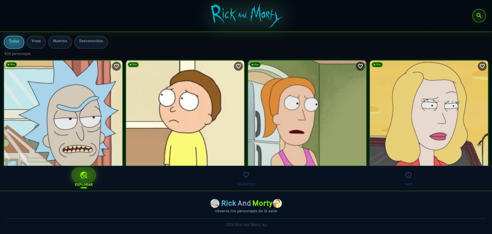
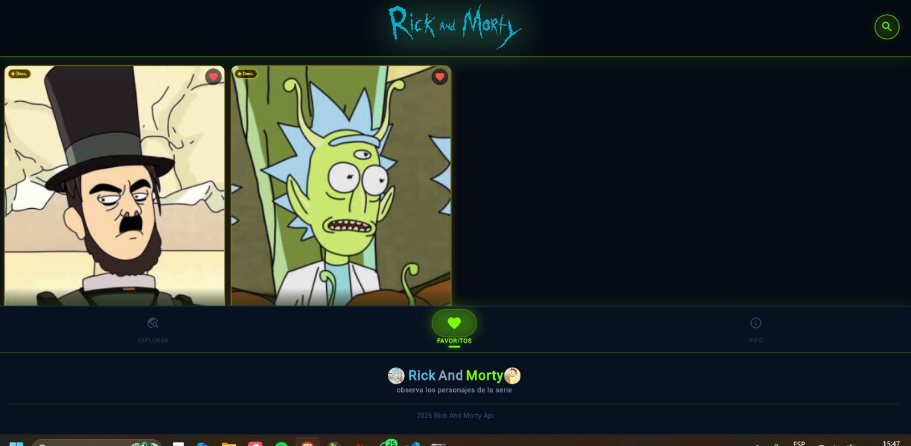
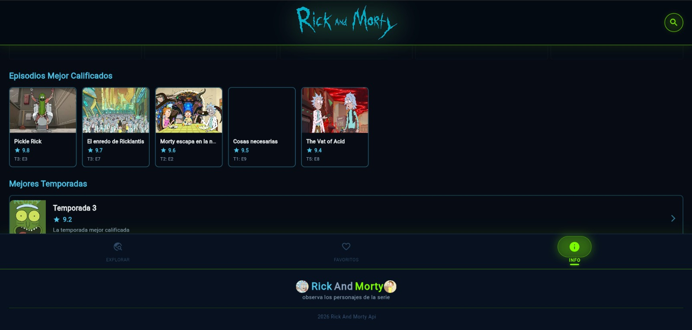

# Rick and Morty App - Flutter

Pagina web desarrollada en *Flutter* que consume la [The Rick and Morty API](https://rickandmortyapi.com/) para mostrar información detallada sobre los personajes de la serie.

---

## modo de instalacion 
1. Clonar el proyecto
   
Abre la terminal y ejecuta:
```bash
git clone https://github.com/NarethWebDev/rick_and_morty_.git
cd rick_and_morty_
  ```
2.Instalar dependencias

Descarga todos los paquetes necesarios (Provider, Shared Preferences, http) definidos en el pubspec.yaml
```bash
flutter pub get
  ```
3. Ejecutar la aplicación

Para ejecutar el proyecto en el navegador ejecuta:

```bash
flutter run -d web-server
  ```
  
---

## Características
* *Listado de Personajes:* Visualización de personajes con scroll infinito.
* *Detalle Individual:* Información sobre estado, especie, género y origen.
* *Filtros Dinámicos:* Búsqueda por nombre y filtrado por estado (vivo, muerto, desconocido).
* *Interfaz Responsiva:* Diseño adaptable para Android e iOS.

---

## Tecnologías y Herramientas
* *Lenguaje:* Dart
* *Framework:* Flutter
* *API:* REST (Rick and Morty API)
* *Paquetes principales:*
    * http o dio (Consumo de API)
    * provider / bloc / riverpod (Gestión de estado)

---

## Contenido de la API
La aplicación utiliza principalmente el endpoint /character. Los objetos procesados contienen:
* *id:* Identificador único.
* *name:* Nombre del personaje.
* *status:* Estado actual (Vivo, Muerto o Desconocido).
* *species:* Especie del personaje.
* *image:* Enlace a la imagen del personaje.
* *location:* Nombre del último lugar conocido.

## Imagenes de evidencia 



